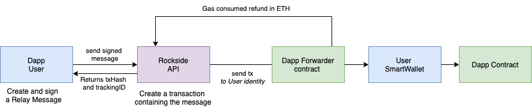

# Smart wallet

### When do I need a smart wallet ?

Meta transaction and message relay is really great, it allows to separate the intention of the user \(example to interact with a dApp\) and the transmission of his intentions via a transaction. The consequence is that the transaction sender is not the one who interact with the dApp.

In some use cases, your users need to interact with contracts that do not implement meta-transaction and use the message.sender to determinate the identity of the user.  For example you cannot relay a message to call the approve method of an ERC20 contract.

For those use cases the use of a smart wallet can be relevant. In order to use your platform you can deploy a smart wallet for your user. Then your user will have to deposit ETH and Token on this smart wallet.. Then you can relay message of your user that can control their smart wallet to interact with the ERC20 contract. This way you can provide your user gasless transaction and all benefits of a relayer \(optimized gas price, auto-replay ... \).

### How Smart Wallet works with Forwarder contracts ?

Rockside provides an [implementation of  smart wallet](https://github.com/rocksideio/contracts/blob/master/contracts/SmartWallet.sol) compatible with the Forwarder contract. You are free to develop your own implementation or use [Rockside Smartwallet AP](https://docs.rockside.io/smart-wallet/smart-wallet-api)I to deploy it for your users.



User signs messages in order to control their smart-wallet so they can approve or send ERC20 tokens. The dApps with its Forwarder contract relay the transaction so users do not have to pay for the gas. The signature and the nonce are checked in the forwarder contract.

An example of calling HEX Smartcontract with a Rockside Smartwallet threw a Forwarder is [available here](https://github.com/rocksideio/Demo-Smartwallet-Hex).

### Smart wallet API



Deploy a SmartWallet



Deploy a smart-wallet to be used with a forwarder






Available networks are mainnet, ropsten





Your API KEY is available on Rockside Dashboard





Owner account of the smartwallet. Account that will sign relay message



Address of the forwarder to trust for the relay.










```javascript
{
    "address": "0x07672cf263BeB920B34b2740596b8B4a28b25D47",
    "transaction_hash": "0xf3ad76a9879a60c1bde76f806d463d0f378e2d1ace78eb62bbde40561f77df36",
    "tracking_id": "01ED9ER94VM4K0V7K7AF8NFGHV"
}
```






